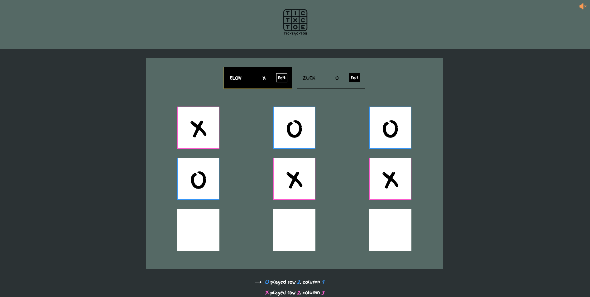

# Tic Tac Toe Game - React + TypeScript

This is a simple Tic Tac Toe game built using React and TypeScript. The game features a player vs player mode, where two players can take turns to place their marks (X and O) on the board. The game automatically detects when there is a winner or a draw and allows players to reset the game.



## Technologies Used

- **React**
- **TypeScript**
- **UUID** (Used for generating unique IDs for game turns)
- **CSS**

## Game Logic

- The game board is a 3x3 grid represented as a 2D array.
- The `gameTurns` array keeps track of each move, storing player, row, and column information.
- The `determineWinner` function checks the board for winning combinations after each move.
- The game automatically alternates between Player 1 (X) and Player 2 (O) after each turn.

## Project Setup

To get started with this project, follow these steps:

### 1. Clone the repository

Clone this repository to your local machine:

```bash
git clone https://github.com/paologhidoni/tictactoe.git
```

### 2. Cd into project and install dependencies

```bash
cd tictactoe
npm install
```

### 3. Run the app

```bash
npm run dev
```

### Components

- **App**: The main component that holds the game state and logic (turns, board, player names, etc.).
- **Header**: A simple header to introduce the game.
- **Player**: Displays the player's name and symbol, and allows editing of player names.
- **GameBoard**: The 3x3 grid where players interact and place their marks.
- **GameOver**: Displays the winner or draw message and includes a button to reset the game.
- **Log**: Displays the history of moves made during the game.

### How to Play

- The game starts with an empty 3x3 grid.
- Players can choose their names by entering them in the Player 1 and Player 2 fields.
- Player 1 will always start with "X", and Player 2 will play with "O".
- Players take turns to click on an empty cell to place their mark.
- The game ends when a player wins or the game results in a draw (when all cells are filled).
- You can reset the game by clicking the "Play again!" button.
